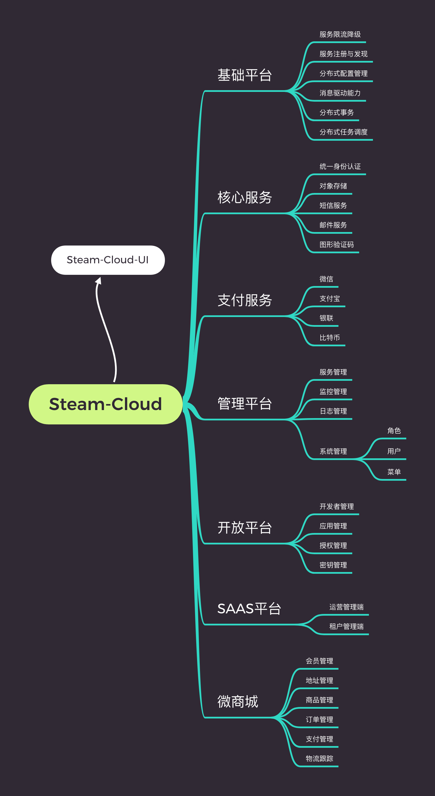
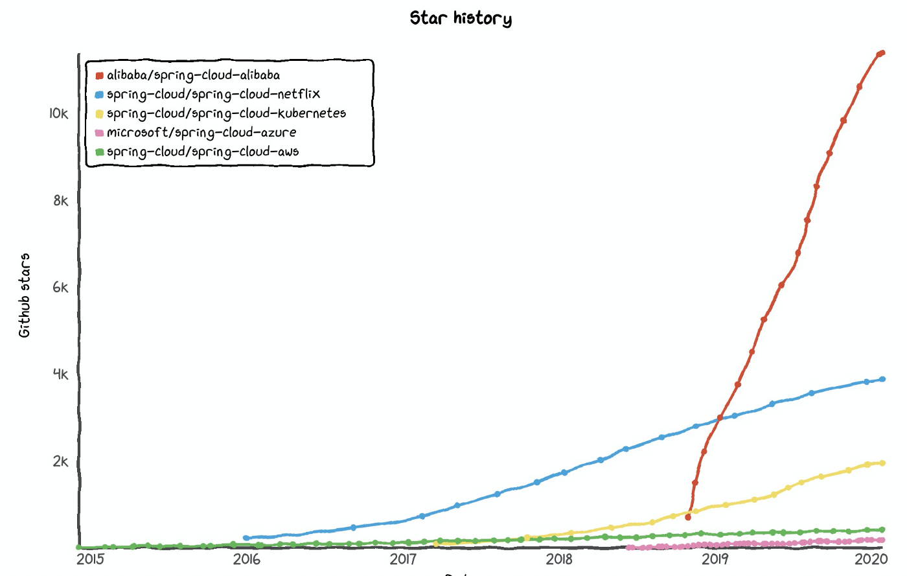
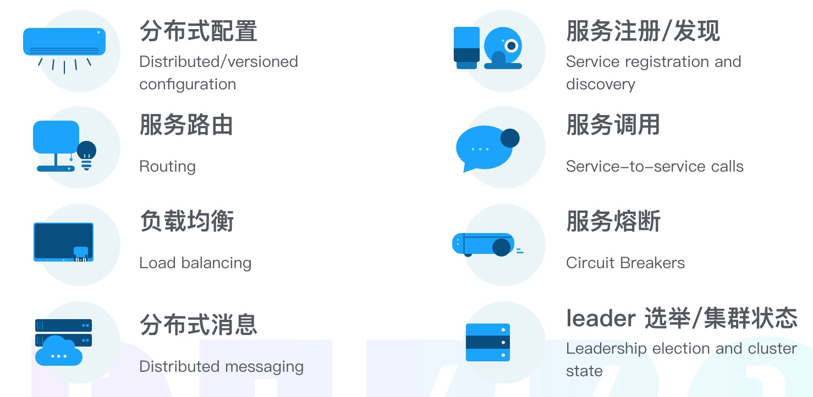
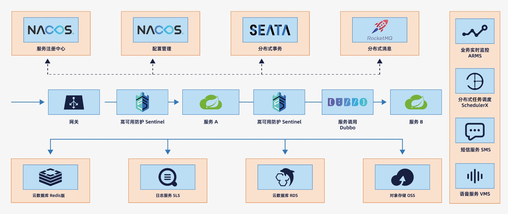
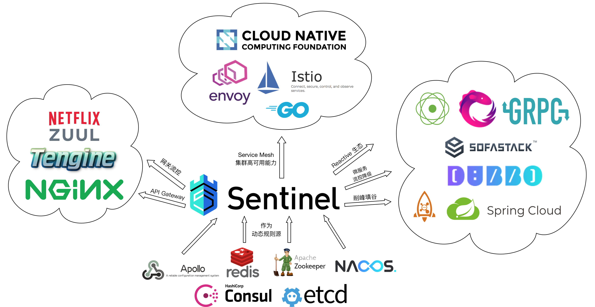

# Steam Cloud

[English](README.md)

[中文文档](README-zh_cn.md)

## Related project

Backend: [steam-cloud](https://github.com/rosky/steam-cloud)

Frontend: [steam-cloud-ui](https://github.com/rosky/steam-cloud-ui)

## Introduction

 🚀 Not Only a microservices framework.

## Work Status

Processing ...Not product availability now.

# 总则

*Growth*, *Fast*, *Controllable*

## Team

* Architecture
* Product
* Development
* Testing
* OP

## Coding Guidelines

* Alibaba Java Coding Guidelines
* Airbnb JavaScript Style Guide

## Features:



# Getting Started

## Preparations

### Development environment

* Linux

* JAVA 8

* IntelliJ IDEA IDE

### Sentinel

* Download demo bin file [here](http://edas-public.oss-cn-hangzhou.aliyuncs.com/install_package/demo/sentinel-dashboard.jar)

* Download release file [here](https://github.com/alibaba/Sentinel/releases)

run:

```
java -jar sentinel-dashboard.jar
```

Admin panel:

release version default login:

* username: sentinel

* password: sentinel

```
http://127.0.0.1:8080/
```

### Nacos

* Download release file [here](https://github.com/alibaba/nacos/releases)

run:

```
unzip nacos-server-1.0.0.zip
cd nacos/bin
sh startup.sh -m standalone
```

Admin panel:

```
http://127.0.0.1:8848/nacos
```

### RocketMQ

* Download release file [here](https://github.com/apache/rocketmq/releases)

run:

```
unzip rocketmq-all-4.7.0.zip
cd rocketmq-all-4.7.0

# Startup Name Server
sh bin/mqnamesrv

# Startup Broker
sh bin/mqbroker -n localhost:9876

# Create topic: test-topic
sh bin/mqadmin updateTopic -n localhost:9876 -c DefaultCluster -t test-topic
```

## Start projects

Run is OK:
```
SentinelServiceApplication :28083/
NacosDiscoveryConsumerSCLBApplication :18083/
DemoApplication :58070/
DubboSpringCloudServletGatewayBootstrap :61178/
DubboSpringCloudWebProviderBootstrap :9090/
NacosGatewayDiscoveryApplication :18085/
RocketMQBusApplication :38080/
SentinelDubboConsumerApp
SentinelDubboProviderApp
SentinelSpringCloudGatewayApplication :28085/
SentinelWebFluxApplication :28084/
SentinelZuulApplication :28086/
SpringCloudConfigClientApplication :28080/
SpringCloudConfigServerApplication :7070/
RocketMQConsumerApplication
SentinelFeignConsumerApplication :18087/
SentinelFeignProviderApplication :18088/
RocketMQProducerApplication :38081/
NacosConfigApplication :18084/
```

Not tested:

```
DubboSpringCloudClientBootstrap
DubboSpringCloudConsumerBootstrap
DubboSpringCloudProviderBootstrap
DubboSpringCloudServerBootstrap
```

## Reference

Trend(Why we choose SCA?):



Features:



Architecture:



Sentinel Features:


Sentinel Ecosystem Landscape:



## Contributing

Come on.
